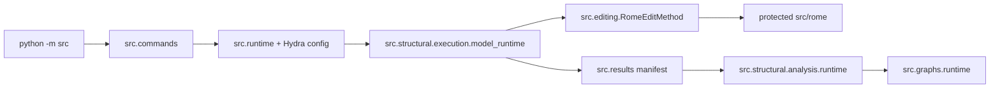

# Latium Framework

Latium is a research framework for applying ROME knowledge edits, capturing
reusable structural measurements, replaying model-free analyses, and rendering
results from saved artifacts. It is developed for cybersecurity research by the
Security@FIT group in collaboration with Red Hat Research.

The current branch is Hydra-first: use `python -m src` with overrides.

## Setup

```bash
python -m venv .venv
source .venv/bin/activate
pip install -r requirements.txt
```

Model runs default to CUDA in the model configs. ROME runs usually need second
moment statistics under `data/second_moment_stats/`. Structural capture skips a
ROME model when those stats are missing by default; set
`structural.run.fail_on_missing_second_moment=true` if missing stats should fail the
run instead.

## Supported Models

Models are selected by config key, for example `model=gpt2-large` or
`structural.run.models=[gpt2-large,qwen3-4b]`. The resolver also accepts exact
HuggingFace names for configured models and fleet model IDs from
`finetuned_qwen3_8b_fleet.json` when present.

Regular model config keys:

```text
gpt2-medium, gpt2-large, gpt2-xl, gpt-j-6b,
llama2-7b, mistral-7b-v0.1, mistral-7b-v0.3,
qwen2.5-1.5b, qwen3-0.6b, qwen3-1.7b, qwen3-4b, qwen3-8b,
qwen3-guard-0.6b, granite4-micro,
deepseek-7b-base, deepseek-r1-llama3-8b,
falcon-7b, opt-6.7b
```

Prefix-variability experiment configs for Qwen3-8B:

```text
qwen3-8b-prefixtest-self-short, qwen3-8b-prefixtest-self-medium,
qwen3-8b-prefixtest-self-long,
qwen3-8b-prefixtest-template-short, qwen3-8b-prefixtest-template-medium,
qwen3-8b-prefixtest-template-long,
qwen3-8b-prefixtest-external-short, qwen3-8b-prefixtest-external-medium,
qwen3-8b-prefixtest-external-long
```

`src/config/model_base/default.yaml` holds shared model defaults. Individual
files in `src/config/model/` should contain model-specific overrides.
`src/config/model/boilerplate.yaml` is a template, not a runnable model.

## Module Flow



The main rule is: expensive model work happens during capture; analyses and
graphs consume saved JSON artifacts through the manifest.

## Common Commands

List available components:

```bash
python -m src command=methods
python -m src --help
```

Inspect a structural run plan without loading a model:

```bash
python -m src command=structural/plan \
  'structural.run.models=[gpt2-large,qwen3-4b]' \
  structural.run.n_tests=5 \
  structural.capture.profile=spectral
```

Capture ROME executions and reusable measurements:

```bash
python -m src command=structural/capture \
  'structural.run.models=[gpt2-large]' \
  'structural.run.edit_methods=[rome]' \
  structural.run.n_tests=30 \
  structural.capture.profile=spectral \
  structural.run.output_dir=analysis_out \
  structural.run.run_id=gpt2-large-n30
```

Analyze an existing run without loading a model:

```bash
python -m src command=structural/analyze \
  structural.analyze.run_root=analysis_out/gpt2-large-n30 \
  structural.analysis.preset=paper
```

Capture and analyze in one command:

```bash
python -m src command=structural/run \
  'structural.run.models=[gpt2-large]' \
  structural.run.n_tests=30 \
  structural.capture.profile=spectral \
  structural.analysis.preset=paper \
  structural.run.run_id=gpt2-large-complete
```

Render graph artifacts from an analyzed run:

```bash
python -m src command=graphs/run \
  graphs.run_root=analysis_out/gpt2-large-complete \
  graphs.renderer_preset=paper
```

Shortcut aliases are available, for example:

```bash
python -m src structural plan 'structural.run.models=[gpt2-large]' structural.run.n_tests=5
python -m src graphs run analysis_out/gpt2-large-complete graphs.renderer_preset=paper
python -m src prefix-experiment prefix_experiment.model=gpt2-large
```

Shortcut commands accept Hydra overrides for options. Argparse-style flags such
as `--models` or `--renderer-preset` are no longer supported in `python -m src`;
use overrides like `structural.run.models=[gpt2-large]` or
`graphs.renderer_preset=paper`.

## Manual ROME

Manual ROME applies one edit and then opens an interactive prompt against the
edited model.

Run with explicit fact fields:

```bash
python -m src command=manual_rome model=gpt2-large \
  'manual.prompt="{} is located in"' \
  'manual.subject="Brno University of Technology"' \
  manual.target_new=Budapest \
  manual.target_true=Brno \
  manual.max_new_tokens=30 \
  manual.do_sample=false
```

You can also use the direct command alias:

```bash
python -m src manual-rome model=gpt2-large \
  'manual.prompt="{} is located in"' \
  'manual.subject="Brno University of Technology"' \
  manual.target_new=Budapest \
  manual.target_true=Brno
```

Run from a CounterFact JSON file or manifest:

```bash
python -m src command=manual_rome model=gpt2-large \
  manual.counterfact_path=manifests/counterfact_seed20260423_n500.json \
  manual.index=0
```

Use `manual.case_id=<id>` instead of `manual.index=<n>` to select a specific
CounterFact case ID. `manual.target_new` and `manual.target_true` may be written
without a leading space; the manual ROME command normalizes them before applying
the edit.

## Artifacts And Reuse

Structural runs write a manifest-backed run root:

```text
analysis_out/<run-id>/
  manifest.json
  plans/<model>/<plan-id>/...
  graphs/<renderer>/...
```

The manifest tracks artifact IDs, paths, config hashes, content hashes, and input
dependencies. Re-running skips current artifacts. Use `structural.run.force=true` or
`graphs.force=true` to recompute explicitly.

## Developer Checks

```bash
make check-rome
make lint
python -m compileall -q src rome_benchmark.py
pytest
```

`make check-rome` verifies that protected ROME paths still match `main`.
